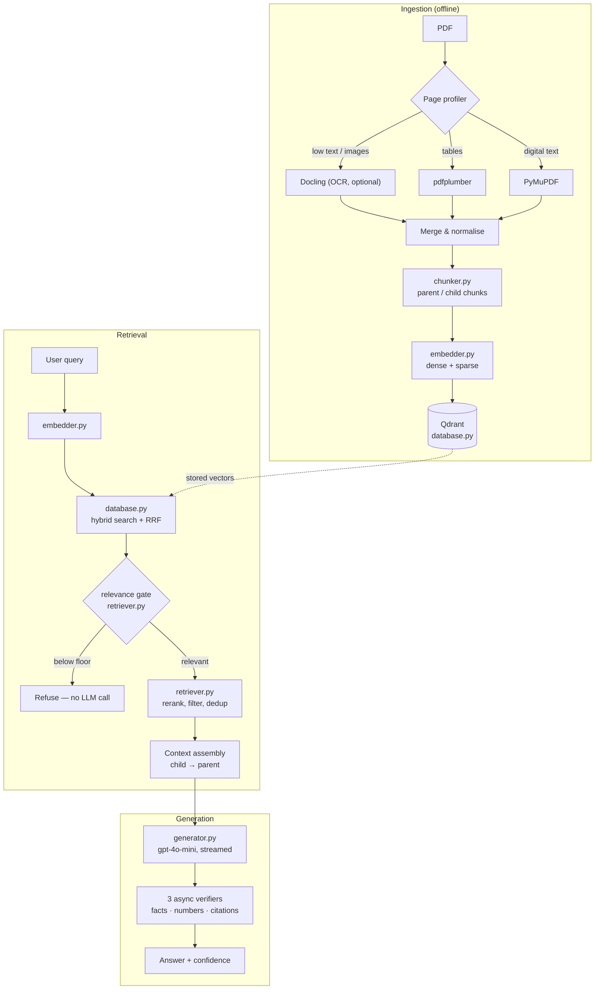

<div align="center">

# StructRAG
**Hybrid Retrieval-Augmented Generation (RAG) System**

[](https://python.org)
[](https://opensource.org/licenses/MIT)
[](https://github.com/AdonisYsh/StructRAG/actions/workflows/codeql.yml)
[](https://github.com/AdonisYsh/StructRAG/actions/workflows/security-scan.yml)

*Precision answer generation across complex financial and academic documents, backed by structured citations and high-fidelity multi-modal extraction.*

</div>

---

## Overview

Standard RAG pipelines break down on structurally dense PDFs — multi-page
financial tables, domain acronyms, figures split across columns.

**StructRAG** targets those cases. It routes each page to the extraction backend
best suited to it, chunks hierarchically so context is never fragmented, retrieves
with parallel dense and sparse search fused by Reciprocal Rank Fusion, and
verifies every answer against the source before reporting a confidence score.

It runs two ways: as a **local CLI**, or as a **hosted web app** you can share a
link to.

## Key Features

- **Multi-modal parsing.** A page profiler routes each page to PyMuPDF (digital
  text), pdfplumber (tables), or Docling (OCR, optional).
- **Hierarchical chunking.** Parent chunks preserve context, child chunks give
  retrieval precision. Table rows and abbreviations get special handling.
- **Hybrid retrieval.** Dense vectors (OpenAI `text-embedding-3-large`) and
  sparse BM25-style vectors are searched in parallel over Qdrant and fused with
  RRF, with adaptive weighting — numeric queries lean sparse, conceptual queries
  lean dense.
- **Triple verification.** After streaming, three background checks run: numeric
  accuracy, claim grounding, and citation formatting. Their results are fused
  into a calibrated confidence score.
- **Built to be exposed.** The hosted mode holds the API key server-side behind
  layered abuse guards and a hard daily spend cap.

---

## Architecture



### 1. Ingestion

A page profiler measures text density and layout, then routes each page:
**PyMuPDF** for digital text, **pdfplumber** for tables (emitted as Markdown),
**Docling** for OCR on scanned pages. `chunker.py` then builds broad **parent**
chunks for context and granular **child** chunks for precision. `embedder.py`
produces both dense OpenAI embeddings and sparse BM25-style term vectors, which
land in **Qdrant**.

### 2. Retrieval

The query is encoded the same two ways. Qdrant is searched with both vector
types and the results fused with RRF, weighted adaptively by query shape.

Then the **relevance gate**: if no chunk clears an absolute cosine-similarity
floor, the request is refused and **no LLM call is made at all**. This is what
keeps a public deployment from being used as a general-purpose chatbot, and it
costs nothing.

Surviving candidates are reranked, deduplicated, and expanded from child chunk
back into surrounding parent text.

### 3. Generation

`generator.py` streams an answer from `gpt-4o-mini` under a hardened prompt that
treats retrieved context strictly as data, never instructions. Three verifiers
then run concurrently — numeric accuracy, atomic-fact grounding, citation
formatting — and their outputs fuse into a confidence score.

---

## Repository structure

```text
StructRAG/
├── main.py              # CLI entry point and REPL
├── pdf_parser.py        # Page profiling and backend routing
├── chunker.py           # Parent/child semantic splitting
├── embedder.py          # OpenAI dense + BM25-style sparse vectors
├── database.py          # Qdrant storage, session-scoped filtering
├── retriever.py         # Hybrid search, RRF, relevance gate, rerank
├── generator.py         # Hardened prompt, streaming, verification
├── models.py            # Pydantic schemas
├── config.py            # All configuration and limits
├── evaluate.py          # RAGAS benchmark harness
│
├── core/                # Shared by CLI and server
│   ├── citations.py     #   Citation stream parser (pure stdlib)
│   └── pipeline.py      #   Transport-agnostic query pipeline
│
├── server/              # Hosted API
│   ├── app.py           #   FastAPI app and guard chain
│   ├── guards.py        #   Tokens, validation, intent gate
│   ├── limits.py        #   Rate limiter and spend ledger
│   └── store.py         #   Per-session document state
│
├── docs/                # Static frontend (GitHub Pages)
├── security/            # Automated vulnerability triage (CI only)
└── tests/               # 181 tests
```

---

## Running the CLI

```bash
git clone https://github.com/AdonisYsh/StructRAG.git
cd StructRAG

python3.12 -m venv venv
source venv/bin/activate          # Windows: venv\Scripts\activate
pip install -r requirements.txt

cp key.env.example key.env        # then add your OPENAI_API_KEY
```

You need a Qdrant. Either run one:

```bash
docker run -p 6333:6333 qdrant/qdrant
```

or use embedded mode with no server at all — set `QDRANT_PATH=./qdrant_storage`
in `key.env`.

Then:

```bash
python main.py /path/to/your/documents/
```

**REPL commands:** type a question · `status` · `stats` · `clear` · `quit`

### Optional extras

```bash
pip install -r requirements-dev.txt        # tests and linters
pip install docling "protobuf<4"           # OCR for scanned PDFs (~3 GB, pulls torch)
pip install ragas datasets                 # RAGAS benchmarking, for evaluate.py
```

OCR is optional by design and is deliberately left out of the Docker image — it
would take the image from 630 MB to roughly 4 GB, with cold starts to match.
Without it, scanned pages yield no text and everything else works:
[pdf_parser.py:456](pdf_parser.py#L456) builds the OCR backend inside a
try/except and falls back gracefully.

---

## Running it as a web app

Full walkthrough in **[DEPLOY.md](DEPLOY.md)**. The short version:

GitHub Pages serves static files and **cannot hold a secret**, so the app splits
into a static frontend on Pages and a containerised API on Render that holds the
key and enforces every limit.

```
GitHub Pages (docs/)  ──HTTPS──>  Render (Dockerfile)  ──>  OpenAI
no secrets                        OPENAI_API_KEY here only
```

Visitors enter an invite code, upload a PDF, and ask questions. Uploads are
private to their session and discarded when it expires.

### How the API key is protected

Guards run cheapest-first, so abuse is rejected before it costs anything:

| Order | Guard | Cost when it trips |
|---|---|---|
| 1 | `DISABLED` kill switch | free |
| 2 | CORS allowlist — explicit origins, never `*` | free |
| 3 | Daily spend cap → 503 | free |
| 4 | Invite code, constant-time compared → expiring signed token | free |
| 5 | Sliding-window rate limits, per session and per IP | free |
| 6 | Input validation — length, PDF structure, active content | free |
| 7 | **Relevance gate** — no matching chunks means refuse | one embedding call |
| 8 | Intent classifier — only runs if retrieval succeeded | one small model call |
| 9 | Hardened prompt, context delimited and neutralised | — |
| 10 | Output token cap | — |

Guard 7 does most of the work. "Write me a Python script" finds nothing in a
corpus of financial filings, so it is refused for effectively nothing — no
prompt engineering required. Guard 3 is the one that actually bounds the bill.

Full threat model: **[SECURITY_CONTEXT.md](SECURITY_CONTEXT.md)**.

---

## Security automation

Seven scanners run in CI. None of them open pull requests.

| Tool | Covers | Reports to |
|---|---|---|
| CodeQL | Dataflow — injection, path traversal, SSRF | Security tab |
| Trivy | Dependency CVEs, image CVEs, Dockerfile misconfiguration | Security tab |
| Gitleaks | Secrets, across the full git history | Security tab |
| Semgrep (`p/owasp-top-ten`) | OWASP Top 10 | Security tab |
| Bandit | Python security lint | Security tab |
| pip-audit | Python dependency CVEs, second opinion to Trivy | Run summary |
| OWASP ZAP | Runtime testing against the live API | Security tab |

Every two days, an agent reads the open alerts and — this is the part that makes
it useful — **writes a test that proves each finding is real and runs it**. Only
confirmed findings become issues. Scanner noise is discarded rather than
forwarded.

Each issue explains what is wrong, why it is there, what an attacker gets, the
reproduction output, and a proposed patch. Add the `approved-fix` label and the
agent opens a pull request that applies the patch and inverts the reproduction
test into a regression guard. Nothing automated ever pushes to `main`.

```
scanners → alert → agent proves it → issue → you add one label → fix PR
```

---

## Testing

181 tests. Every OpenAI call is stubbed, so a full run costs nothing.

```bash
pip install -r requirements-dev.txt
pytest -q
```

Notable coverage: the citation stream parser against arbitrary token boundaries;
session isolation; every abuse guard; and a regression test asserting that N
chunks produce **one** embedding request rather than N.

---

## Evaluation

```bash
pip install ragas datasets
python evaluate.py
```

Benchmarks against datasets like FinanceBench using RAGAS, reporting context
precision, context recall, faithfulness, and answer relevancy.

---

## Configuration

Everything lives in [config.py](config.py), all overridable by environment
variable. The ones worth knowing:

| Variable | Default | Effect |
|---|---|---|
| `RELEVANCE_FLOOR` | `0.28` | How strictly off-topic questions are refused |
| `DAILY_USD_CAP` | `0.70` | Hard spend stop, ~$21/month |
| `MAX_QUERIES_PER_HOUR` | `60` | Per session |
| `MAX_PDF_PAGES` | `50` | Upload page limit |
| `QDRANT_PATH` | *(unset)* | Set for embedded Qdrant, no server needed |
| `DISABLED` | `0` | `1` makes every endpoint return 503 |

See [key.env.example](key.env.example) for the full list.

---

## Contributing

Bug reports and ideas are welcome — open an issue.

Security problems: please **do not** open a public issue. See
[SECURITY.md](SECURITY.md) for private reporting.

If you send a pull request, run `pytest -q` and `ruff check .` first. Installing
the pre-commit hooks (`pre-commit install`) runs both plus secret scanning
automatically.

## License

MIT. See [LICENSE](LICENSE).

---
<div align="center">
  <i>Built for high-stakes document intelligence.</i>
</div>
